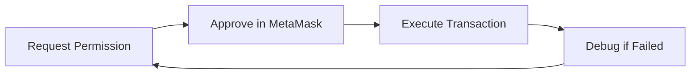

# 🎯MetaMask Advanced Permissions Dev Cook-Off - Feedback Submission

<div align="center">

**Project:** Agent-7715 | **Category:** Best Feedback 💰

[](https://metamask.io/flask/)
[](https://eips.ethereum.org/EIPS/eip-7715)
[](https://sepolia.etherscan.io/)

</div>

---

## 📋 Table of Contents

- [🚨 Critical Issues](#-critical-issues)
  - [1. Error Clarity & Debugging Experience](#1-metamask-smart-accounts-kit-error-clarity--debugging-experience)
  - [2. Documentation Gaps](#2-documentation-gaps-supported-networks--features)
- [🔧 Developer Experience Pain Points](#-developer-experience-pain-points)
  - [3. Parameter Complexity](#3-permissioncontext--parameter-complexity)
  - [4. Bundler Configuration Confusion](#4-bundler-configuration--smart-account-setup-confusion)
  - [5. Testing Workflow Challenges](#5-testing--iteration-workflow-challenges)
  - [6. Network Migration Difficulties](#6-network-migration-difficulties)
  - [7. Example Code Completeness](#7-documentation-example-code-completeness)
  - [8. Session Key Lifecycle](#8-session-key--permission-lifecycle-documentation)
- [⭐ Overall Assessment](#-overall-assessment)

---

## 🚨 Critical Issues

### 1. MetaMask Smart Accounts Kit: Error Clarity & Debugging Experience

**📍 Context:**  
Building an AI Agent using `wallet_grantPermissions` (ERC-7715) for autonomous trade execution. Initial development on **Arbitrum One Mainnet**, later migrated to **Ethereum Sepolia**.

#### ❌ The Critical Issue

When calling `wallet_grantPermissions` on Arbitrum One via MetaMask Flask Snap:

```
Error: "Invalid response structure"
```

#### 💔 Why This Is Painful

| Problem | Impact |
|---------|--------|
| **Zero Context** | No indication of root cause (unsupported chain? RPC issue? malformed request?) |
| **Debugging Black Hole** | Spent hours debugging code structure when it was actually a network support issue |
| **Misleading Direction** | Error message pointed to code quality, not infrastructure compatibility |

#### 💡 Suggested Solution

The Snap/SDK should return **specific error codes**:

```typescript
// Instead of generic error
throw new Error("Invalid response structure");

// Return specific codes
throw new Error("UNSUPPORTED_CHAIN: ERC-7715 not available on Chain ID 42161");
throw new Error("BUNDLER_ERROR: Failed to connect to bundler at <url>");
throw new Error("INVALID_PARAMS: Missing required field 'caveats'");
```

> **Impact:** This single change would save developers **hours** of debugging time.

---

### 2. Documentation Gaps: Supported Networks & Features

#### 🤔 The Problem

No clear "Compatibility Matrix" exists for ERC-7715 features. We assumed Arbitrum (major L2) would be supported, leading to wasted development time.

#### 🎯 What's Needed

A live **Network Support Status Page** showing:

| Feature | Sepolia | Base Sepolia | Arbitrum One | Optimism | Polygon |
|---------|---------|--------------|--------------|----------|---------|
| ERC-7715 Permissions | ✅ | ✅ | ❌ | ❓ | ❓ |
| Session Keys | ✅ | ✅ | ❌ | ❓ | ❓ |
| Batch Transactions | ✅ | ⚠️ | ❌ | ❓ | ❓ |
| Recommended Bundler | `bundler.sepolia.io` | `base-bundler.io` | N/A | N/A | N/A |

> **Suggestion:** Add this table directly to the main documentation homepage.

---

## 🔧 Developer Experience Pain Points

### 3. `permissionContext` & Parameter Complexity

#### 🧩 The Issue

Constructing the `wallet_grantPermissions` request object is **error-prone**:
- Deep nesting of `caveats` → `args` → `conditions`
- Strict field requirements (`checkFrequency`, `limit` formats)
- Generic errors on validation failures

#### ✅ Positive Note

> Once working, the **User Experience is incredible**. The ability to sign *once* and let the agent trade autonomously is exactly what DeFi needs. The permission prompt UI in MetaMask Flask is clean and readable.

#### 💡 Suggestion

Provide a **schema validator** or helper function:

```typescript
import { validatePermissionRequest } from '@metamask/smart-accounts-kit';

const request = {
  // ... complex nested structure
};

const validation = validatePermissionRequest(request);
if (!validation.valid) {
  console.error(validation.errors); // Specific field-level errors
}
```

---

### 4. Bundler Configuration & Smart Account Setup Confusion

#### 🌐 The Issue

The relationship between **Bundlers**, **Smart Accounts**, and **Permission Contexts** was unclear:

- ❓ **Which bundler to use?** Different networks require different URLs, not centralized
- ❓ **How to verify bundler status?** Hard to distinguish bundler vs smart account vs permission failures
- ❓ **Session account vs EOA?** Took time to understand the distinction

#### 💡 Suggested Solution

Add a **"Quick Start Checklist"** in docs:

```markdown
## 🚀 Quick Start

1. ✅ Install [MetaMask Flask](https://metamask.io/flask/)
2. ✅ Connect to **Sepolia** (recommended testnet)
3. ✅ Use bundler: `https://bundler.sepolia.io`
4. ✅ Copy this minimal working example:
   ```typescript
   const permissions = await requestPermissions({...});
   ```
5. ✅ Troubleshoot using our [Decision Tree](#troubleshooting)
```

---

### 5. Testing & Iteration Workflow Challenges

#### ⏱️ The Pain Point

Testing ERC-7715 requires the full approval flow **every single time**:



Each iteration = **~5 minutes** (request → approve → wait → check logs)

#### 😫 What I Wished Existed

- 🧪 **Mock Mode**: Simulate MetaMask approval without UI interaction
- 🏠 **Local Hardhat Support**: Better integration (we burned faucet funds on public Sepolia)
- ⚡ **Dev Mode**: Auto-approve permissions in development environment

> **Impact:** Slowed velocity significantly. Simple parameter tweaks required full round trips.

---

### 6. Network Migration Difficulties

#### 📖 Our Story

**Timeline of Pain:**

1. ⏰ **Hour 0-8**: Built on Arbitrum One (assumed it was supported)
2. 🐛 **Hour 8-16**: Hit "Invalid response structure", debugged our code
3. 🔍 **Hour 16-18**: Suspected RPC issues, tried different providers
4. 💡 **Hour 18**: Tried Sepolia as "last resort"
5. ✅ **Hour 18.5**: **It worked immediately**

#### 💸 The Cost

**~8 hours wasted** debugging before switching networks.

#### 💡 Prevention Strategy

**In-App Detection:**
```typescript
// When MetaMask detects unsupported chain
if (chainId === 42161) {
  showModal({
    title: "Network Not Supported",
    message: "ERC-7715 permissions are currently experimental. Try Sepolia or Base Sepolia.",
    action: "Switch to Sepolia"
  });
}
```

**Documentation Banner:**
> ⚠️ **Currently Tested On:** Sepolia, Base Sepolia. Other networks may have limited support.

---

### 7. Documentation: Example Code Completeness

#### ✅ What Was Great

- High-level ERC-7715 concept explanations are excellent
- Architecture diagrams are helpful

#### ❌ What Was Missing

| Gap | Why It Matters |
|-----|----------------|
| **End-to-end examples** | Snippets show isolated steps, not full flow |
| **Error handling patterns** | What to do when permission denied? Session expired? Bundler failed? |
| **TypeScript types** | `@metamask/smart-accounts-kit@0.3.0` had incomplete definitions |

#### 💡 Suggestion

Create a **"Reference Implementation"** repo:

```
📁 metamask-agent-reference/
├── 📄 README.md (setup instructions)
├── 📁 src/
│   ├── connect-wallet.ts
│   ├── request-permissions.ts
│   ├── execute-transaction.ts
│   └── handle-errors.ts
├── 📁 tests/
│   └── integration.test.ts
└── 📄 package.json
```

With **actual working code** that compiles and runs.

---

### 8. Session Key & Permission Lifecycle Documentation

#### ❓ Unanswered Questions

We had to **experiment** to find answers to:

- ⏰ How long do session keys last?
- 🔒 Can users revoke permissions after granting?
- 💾 Do permissions persist across browser sessions?
- ⏳ What happens when validity period expires?

#### 💡 Needed Documentation Section

```markdown
## 🔑 Permission Lifecycle

### Expiration
- Default: 30 days from grant
- Configurable via `validUntil` parameter
- Auto-renewal: Not supported (requires new approval)

### Revocation
- User: Settings → Permissions → Revoke
- Programmatic: `revokePermission(context)`
- Effect: Immediate (pending txs may complete)

### Persistence
- Browser: Survives page refresh
- Device: Tied to MetaMask vault
- Recovery: Lost on wallet reset
```

---

## ⭐ Overall Assessment

### 📊 Rating: 3.5/5 Stars
**"Innovative but with rough edges"**

### ✅ What We Loved

| Feature | Why It's Great |
|---------|----------------|
| 🎨 **Permission Prompt UI** | Clean, understandable, professional |
| ⚡ **UX When Working** | Magical — approve once, trade forever |
| 🔧 **Viem Integration** | Excellent developer experience |
| 🎯 **Caveats System** | Elegant permission scoping model |

### ❌ Pain Points

- 🔴 Generic error messages
- 🟡 Unclear network support
- 🟠 Cumbersome testing workflow  
- 🟢 Incomplete documentation

---

## 🎬 Conclusion

> **Despite the challenges, we built a working autonomous trading agent in 48 hours.**  
> That speaks volumes about the **potential** of this technology.

### 🚀 Impact of Suggested Improvements

With these changes, future hackathon participants will:
- ✅ Save **10+ hours** on debugging
- ✅ Ship **faster** with clear examples
- ✅ Build **more confidently** with network clarity
- ✅ Test **more efficiently** with better tooling

### 💭 Final Thoughts

The **Agentic Ethereum** vision is incredibly powerful. With better error messages, a network compatibility matrix, improved testing tools, and complete documentation, this stack will be a **massive unlock** for AI Agents on-chain.

I'm genuinely excited to see ERC-7715 move to stable/public MetaMask! 🎉

---

<div align="center">

**Submitted with 💙 by the Agent-7715 Team**

*Building the future of autonomous DeFi, one permission at a time*

</div>
